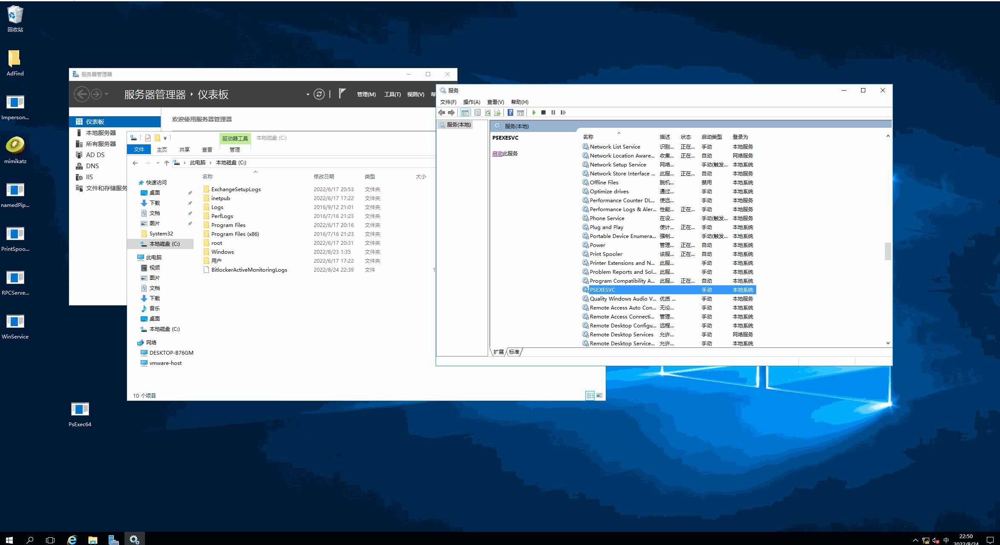

# MyPsExec

MyPsExec是根据[Sysinternal Suite](https://docs.microsoft.com/en-us/sysinternals/downloads/sysinternals-suite)中的PsExec提供的功能实现的demo，仅供学习参考。

PsExec原理以及实现过程可以参考：

http://a3bz.top/2022-8-8-psexec%E5%8E%9F%E7%90%86%E5%88%86%E6%9E%90%E5%92%8C%E5%AE%9E%E7%8E%B0/

**Note**

编译的时候需要Release版本，否则启动服务会失败。

## TODO LIST

- [x] 明文密码登录
- [x] 交互执行命令
- [ ] 多线程实现命名管道
- [ ] 分段读取超出缓冲区的数据
- [ ] NTLM-Hash登录
